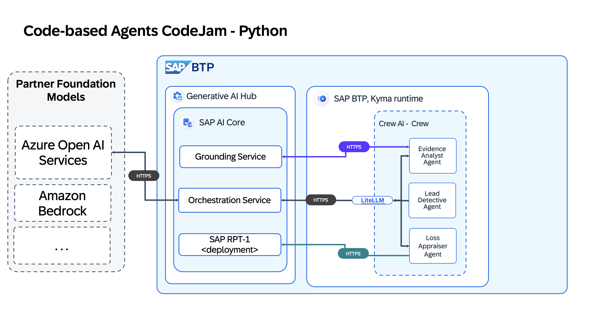
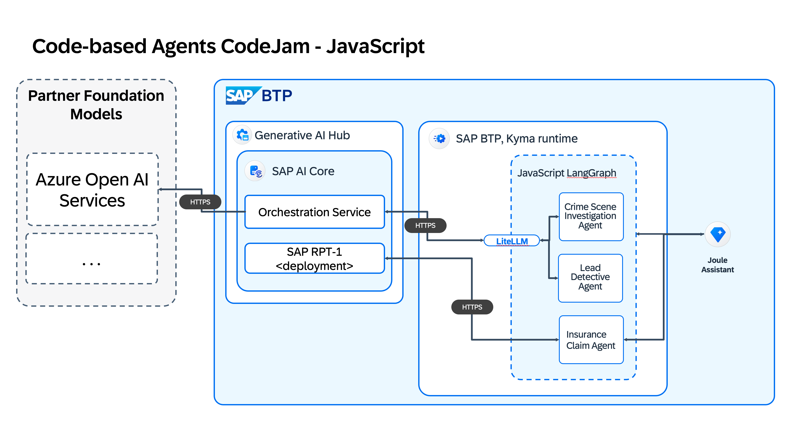

# CodeJam - Build code-based AI Agents on SAP Business Technology Platform

## Description

This repository contains the material for the "Build code-based AI Agents on SAP Business Technology Platform" CodeJam.

## Overview

In this CodeJam, you will learn how to build state-of-the-art AI agents using Generative AI Hub, Python and JavaScript. You will also gain the skills to create custom tools for your agents, including leveraging the SAP-RPT-1 model and SAP's grounding service. Finally, you will deploy your agents to BTP.

For this CodeJam you will use:

- Python, CrewAI and LiteLLM

You will learn more about the following SAP technologies:

- Generative AI Hub on SAP AI Core
- SAP-RPT-1
- Grounding Service
- SAP AI Launchpad
- Business Application Studio (Python)

### Python Solution Diagram

<!-- ### JavaScript Solution Diagram

 -->
## Session prerequisites

For this CodeJam, the Developer Advocates provide a fully functioning system. You only need a laptop with a chromium-based browser installed.

## Exercises

<!-- In this CodeJam you can choose between two different technology stacks. Both are relevant for working with Agents and AI solutions, the differences are the progamming language and the frameworks being used for building the AI agents.

If you are unsure on which path you should choose, ask the instructor for guidance.
 -->
- [Exercise 00 - Understanding Generative AI Hub in SAP AI Core](./exercises/Python/00-understanding-genAI-hub.md)
- [Exercise 01 - Setup SAP Business Application Studio and your personald development space](./exercises/Python/01-setup-dev-space.md)
- [Exercise 02 - Build your first AI Agent](./exercises/Python/02-build-a-basic-agent.md)
- [Exercise 03 - Build your first agent tool](./exercises/Python/03-add-your-first-tool.md)
- [Exercise 04 - Building a multi-agent system](./exercises/Python/04-building-multi-agent-system.md)
- [Exercise 05 - Add the Grounding service](./exercises/Python/05-add-the-grounding-service.md)
- [Exercise 06 - Use your AI Agents to solve the crime](./exercises/Python/06-solve-the-crime.md)

The instructor will start you on the first exercise. Proceed to the next exercise once the instructor tells you to.

For this CodeJam you are provided with a subaccount on SAP BTP. The subaccount is only available for the duration of this CodeJam.

## Frequently asked Questions

You can find a list of frequently asked questions in the [Frequently Asked Questions Document](./frequently-asked-questions.md)

## Further Learning on AI

### YouTube Videos
SAP Developers YouTube channel: [SAP Business AI playlist](https://www.youtube.com/playlist?list=PL6RpkC85SLQCDxe58RfZaLCcPqcgwTIhj)

### Learning
- [Learning Journey - Solving Business Problems using SAP's Generative AI Hub](https://learning.sap.com/learning-journeys/solving-business-problems-using-sap-s-generative-ai-hub)
- [Basic Trial of Generative AI Hub](https://www.sap.com/products/artificial-intelligence/generative-ai-hub-trial.html)

<!-- ### Customer & Partner projects -->

<!-- ### 3rd-Party content -->

## Feedback

If you can spare a couple of minutes at the end of the session, please provide feedback to help us improve next time.

Use this [Give feedback](https://github.com/SAP-samples/codejam-code-based-agents/issues/new?assignees=&labels=feedback&template=session-feedback-template.md&title=Session%20Feedback) link to create a special "feedback" issue, and follow the instructions in there.

Thank you!

## Other CodeJams

### CodeJam Community

- [SAP CodeJam Events](https://community.sap.com/t5/sap-codejam/eb-p/codejam-events)
- [SAP CodeJam Community](https://community.sap.com/t5/sap-codejam/gh-p/code-jam)
- [SAP CodeJam Discussions](https://community.sap.com/t5/sap-codejam-discussions/bd-p/code-jamforum-board)

## Known Issues

## How to obtain support

[Create an issue](https://github.com/SAP-samples/<repository-name>/issues) in this repository if you find a bug or have questions about the content.

For additional support, [ask a question in SAP Community](https://answers.sap.com/questions/ask.html).

## License

Copyright (c) 2026 SAP SE or an SAP affiliate company. All rights reserved. This project is licensed under the Apache Software License, version 2.0 except as noted otherwise in the [LICENSE](LICENSE) file.
