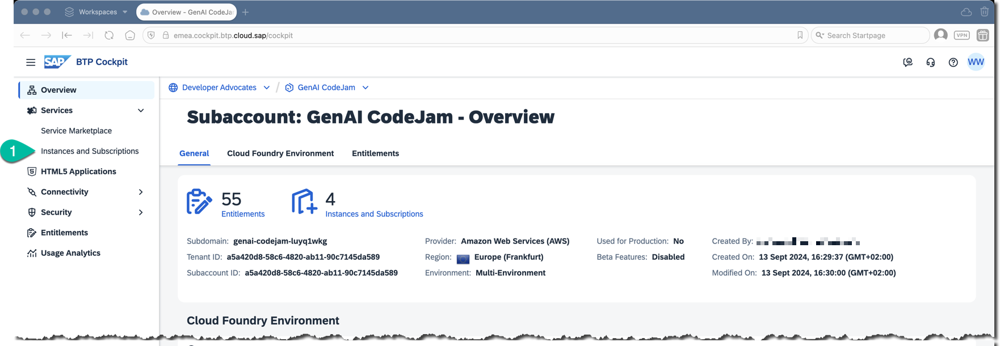
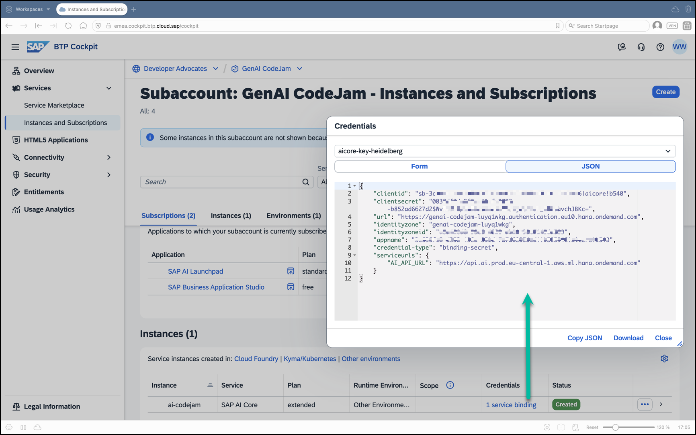

# Understanding Generative AI Hub in SAP AI Core
SAP AI Core is SAP's AI runtime. Here you can train your own models, fine-tune models or deploy machine learning models. [Generative AI Hub in SAP AI Core](https://help.sap.com/docs/sap-ai-core/sap-ai-core-service-guide/generative-ai-hub-in-sap-ai-core-7db524ee75e74bf8b50c167951fe34a5) is the way to access large language models (LLMs) at SAP. Here you can find all the models of all the model providers we partner with as well as our own SAP-RPT-1 model or any fine-tuned and a variety of self hosted open source models.

[SAP AI Launchpad](https://help.sap.com/docs/ai-launchpad) is the UI for SAP AI Core and Generative AI Hub and is a multitenant SaaS application on SAP BTP. You can use it to try out or deploy models, to start training jobs, evaluation jobs, build orchestration pipelines and much more.

## [1/3] Open SAP Business Technology Platform
👉 Open SAP [BTP Cockpit](https://emea.cockpit.btp.cloud.sap/cockpit).

👉 Navigate to the subaccount: [`GenAI CodeJam`](https://emea.cockpit.btp.cloud.sap/cockpit#/globalaccount/275320f9-4c26-4622-8728-b6f5196075f5/subaccount/a5a420d8-58c6-4820-ab11-90c7145da589/subaccountoverview).

## [2/3] Open SAP AI Launchpad and connect to SAP AI Core
👉 Go to **Instances and Subscriptions**.

Check whether you see an **SAP AI Core** service instance and an **SAP AI Launchpad** application subscription.

With SAP AI Launchpad, you can administer all your machine learning operations. ☝️ You have the `extended` plan of SAP AI Core service instance, so that you can access capabilities of Generative AI Hub.

☝️ In this subaccount the connection between the SAP AI Core service instance and the SAP AI Launchpad application is already established. Otherwise you would have to add a new AI runtime using the SAP AI Core service key information.

Should you need to connect to the SAP AI Core to SAP AI Launchpad, you would need the credentials from the SAP AI Core secret.

👉 Open **SAP AI Launchpad**. Make sure you authenticate your user using the **Default Identity Provider**.

## [3/3] Select the resource group code-based-agent-codejam
SAP AI Core tenants use [resource groups](https://help.sap.com/docs/sap-ai-core/sap-ai-core-service-guide/resource-groups) to isolate AI resources and workloads. Scenarios (e.g. `foundation-models`) and executables (a template for training a model or creation of a deployment) are shared across all resource groups within the instance.

>DO NOT USE THE DEFAULT `default` RESOURCE GROUP!

👉 Go back to **Workspaces**.

👉 Select your workspace (like `codejam-YYY`) and your resource group `ai-agent-codejam`.

👉 Make sure it is set as a context. The proper name of the context, like `codejam-YYY (team-XX)` should show up at the top next to SAP AI Launchpad.

☝️ You will need the name of your resource group in [Exercise 01-setup-dev-space](01-setup-dev-space.md).

[Next Exercise](01-setup-dev-space.md)
