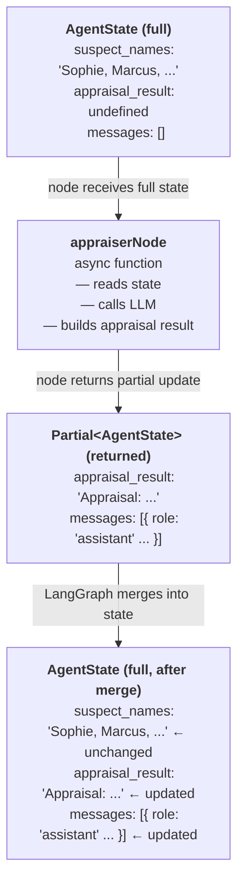
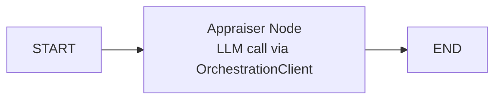

# Build Your First AI Agent

For this CodeJam, you will build three agents. Each of these agents will take an active part in solving a burglary and executing a loss appraisal for an insurance claim.

After any good burglary you need a loss appraiser who determines the insurance claims. That will be the first agent you are going to build.

---

## Overview

In this exercise, you will build an agent with TypeScript, LangGraph and the SAP Cloud SDK for AI.

[**LangGraph**](https://langchain-ai.github.io/langgraphjs/) is an open-source library for building stateful, multi-step workflows with LLMs. It models your agent logic as a **graph**; a set of nodes (steps) connected by edges (transitions). Unlike simpler agent frameworks, LangGraph gives you explicit control over how state flows through your application, making it ideal for complex, multi-agent systems.

[**SAP Cloud SDK for AI**](https://github.com/SAP/ai-sdk-js) is SAP's official TypeScript/JavaScript SDK for interacting with SAP AI Core. It provides the `OrchestrationClient` to call any model available in Generative AI Hub through a unified API, no matter whether you're using GPT-4o from Azure OpenAI, Claude from Anthropic, or Llama from Meta. You do not need to deploy models yourself; the SDK routes calls through the Orchestration Service to SAP's partner foundation models.

This combination is extremely powerful: LangGraph handles the agent workflow structure, while the SAP Cloud SDK for AI handles model access and authentication.

---

## Create a Basic Agent

### Step 1: Set Up Your Project

👉 Navigate to the starter project folder: [`/project/JavaScript/starter-project/`](/project/JavaScript/starter-project/)

👉 Install dependencies:

```bash
npm install
```

### Step 2: Create the Agent State

LangGraph agents are built around **explicit state**: a typed object that you define, passed between nodes as the workflow progresses.

**Why does LangGraph make you manage state yourself?**

You might expect the framework to handle this automatically; track what each agent produced, route it to the next one, and stitch everything together behind the scenes. CrewAI does something closer to this: agents pass results implicitly through task context, and the framework manages the handoff.

LangGraph takes the opposite approach deliberately. Here is why:

- **Your workflow is unique.** Different applications need different data flowing between steps. A customer service workflow needs ticket IDs, sentiment scores, and escalation flags. An investigation workflow needs appraisal results, evidence analysis, and suspect names. No generic "agent result" object could cover all these cases well. By defining your own `AgentState`, you get a type that is exactly shaped for your use case.

- **Explicit state is debuggable.** When something goes wrong in a multi-agent system, the first question is always "what data did the failing agent actually receive?". With explicit state, you can `console.log(state)` at the start of any node and see the complete picture. There is no hidden internal state to guess at. You can also easily attach observability tools to the `AgentState` to have auditing over the agentic flow.

- **Nodes stay isolated and testable.** Because each node is just a function that takes state and returns state, you can unit test any node in isolation by passing in a mock state object. No need to spin up the full graph. This is much harder when agents communicate through implicit framework channels.

- **State is the communication protocol between agents.** When your Evidence Analyst writes to `evidence_analysis` and your Lead Detective reads from it, that contract is visible in the `AgentState` type. If you rename a field or change its structure, TypeScript immediately flags every node that is affected. With implicit communication, these mismatches only surface at runtime.

The trade-off is that you write a few extra lines of code to define the state and return partial updates. In exchange, you get a system where data flow is transparent, type-checked, and completely under your control.

👉 Create a new file [`/project/JavaScript/starter-project/src/types.ts`](/project/JavaScript/starter-project/src/types.ts)

👉 Add the following type definitions:

```typescript
/**
 * Agent state for LangGraph
 */
export interface AgentState {
  suspect_names: string;
  appraisal_result?: string;
  messages: Array<{
    role: string;
    content: string;
  }>;
}
```

> 💡 **What's happening here?**
>
> - `AgentState` is the shared state object that flows through your LangGraph workflow
> - `suspect_names` — input data passed in at the start; all nodes can read it
> - `appraisal_result` — optional (`?`) because it is `undefined` until the appraiser node runs and writes to it
> - `messages` — the conversation history, accumulated across all nodes
>
> Each node returns only the fields it changed (`Partial<AgentState>`). LangGraph merges that partial update into the full state before calling the next node. Fields not mentioned in the return value remain exactly as they were.

### Step 3: Create the OrchestrationClient

The `OrchestrationClient` from the SAP Cloud SDK for AI is how your agent communicates with LLMs in Generative AI Hub. The SAP Cloud SDK for AI handles authentication automatically using your environment variables, this is also true for the Python library.

👉 Create a new file [`/project/JavaScript/starter-project/src/basicAgent.ts`](/project/JavaScript/starter-project/src/basicAgent.ts)

👉 Add the following code:

```typescript
import "dotenv/config";
import { OrchestrationClient } from "@sap-ai-sdk/orchestration";
import type { AgentState } from "./types.js";

const orchestrationClient = new OrchestrationClient(
  {
    llm: {
      model_name: process.env.MODEL_NAME!,
      model_params: {
        temperature: 0.7,
        max_tokens: 1000,
      },
    },
  },
  { resourceGroup: process.env.RESOURCE_GROUP },
);
```

> 💡 **Understanding the OrchestrationClient:**
>
> - `model_name: process.env.MODEL_NAME!` — reads the model name from your `.env` file. The `!` tells TypeScript you're certain the value exists (non-null assertion).
> - `model_params` — configure the LLM behaviour: `temperature` controls creativity (0 = deterministic, 1 = creative), `max_tokens` limits response length.
> - `resourceGroup` — the SAP AI Core resource group to use. This isolates your AI workloads.
>
> No API keys or URLs needed! The SDK automatically reads your SAP AI Core credentials from `AICORE_SERVICE_KEY` or the CF binding.
> The approach of using `AICORE_SERVICE_KEY` within the `.env` file is only recommended for local testing, if you want to deploy your agent application to production use Cloud Foundry's service bindings through `VCAP`.

### Step 4: Build the Agent Node

In LangGraph, a **node** is an async function that represents one step in your workflow. Every node follows the same contract:

- **Input**: the current `AgentState`, the full state object as it exists at that point in the graph
- **Output**: `Promise<Partial<AgentState>>`, only the fields this node changed

LangGraph merges your partial return into the full state and passes it to the next node. This means:

- You never manually copy unchanged fields; just return what you updated
- Each node is isolated and only responsible for its own piece of work
- Nodes are plain async TypeScript functions, no decorators, no class inheritance required



👉 Add the appraiser node to your `basicAgent.ts`:

```typescript
async function appraiserNode(state: AgentState): Promise<Partial<AgentState>> {
  console.log("\n🔍 Appraiser Agent starting...");

  const response = await orchestrationClient.chatCompletion({
    messages: [
      {
        role: "system",
        content:
          "You are an expert insurance appraiser specializing in fine art valuation and theft assessment.",
      },
      {
        role: "user",
        content:
          "Provide a brief explanation of how an insurance appraiser would approach assessing stolen artwork and valuables.",
      },
    ],
  });

  const appraisalResult = response.getContent() ?? "No response received.";
  console.log("✅ Appraisal complete");

  return {
    appraisal_result: appraisalResult,
    messages: [
      ...state.messages,
      { role: "assistant", content: appraisalResult },
    ],
  };
}
```

> 💡 **Understanding the node:**
>
> - `Promise<Partial<AgentState>>` — the return type tells TypeScript (and LangGraph) that this function returns a promise of a partial state update. You only include the fields you changed; LangGraph merges them into the full state automatically. If you forget a field, it stays at its current value; it does not get reset.
> - `orchestrationClient.chatCompletion({ messages })` — sends a conversation to the LLM as a list of messages. The `system` message sets the agent's persona and instructions. The `user` message is the actual question or task.
> - `response.getContent()` — extracts the text content from the LLM response. The `??` operator provides a fallback if the result is `null` or `undefined` (for example, if the LLM returned nothing).
> - `...state.messages` — the **spread operator** copies all existing messages into a new array, then appends the new one. This is necessary because you should never mutate `state` directly. Always return a new object. Mutating state can cause subtle bugs in multi-node graphs where LangGraph tracks changes between steps.

### Step 5: Build the LangGraph Workflow

Now you'll wire the node into a LangGraph `StateGraph`.

👉 Add the following to your `basicAgent.ts`:

```typescript
import { StateGraph, END, START } from "@langchain/langgraph";

function buildGraph() {
  const workflow = new StateGraph<AgentState>({
    channels: {
      suspect_names: null,
      appraisal_result: null,
      messages: null,
    },
  });

  workflow
    .addNode("appraiser", appraiserNode)
    .addEdge(START, "appraiser")
    .addEdge("appraiser", END);

  return workflow.compile();
}

async function main() {
  const app = buildGraph();

  const initialState: AgentState = {
    suspect_names: "Sophie Dubois, Marcus Chen, Viktor Petrov",
    messages: [],
  };

  const result = await app.invoke(initialState);

  console.log("\n" + "=".repeat(50));
  console.log("Insurance Appraiser Report:");
  console.log("=".repeat(50));
  console.log(result.appraisal_result);
}

main();
```

> 💡 **Understanding the StateGraph:**
>
> - `channels` defines all the fields in your state. Setting a channel to `null` means LangGraph will use simple value replacement (last writer wins).
> - `.addNode('appraiser', appraiserNode)` — registers the function as a node with the name `'appraiser'`
> - `.addEdge(START, 'appraiser')` — connects the graph start to the appraiser node
> - `.addEdge('appraiser', END)` — when the appraiser finishes, the workflow ends
> - `.compile()` — validates the graph and returns an executable app
> - `app.invoke(initialState)` — runs the workflow and returns the final state

### Step 6: Run Your Agent

👉 Run your agent:

> ☝️ Make sure you're in the starter project directory when running this command.

```bash
npx tsx src/basicAgent.ts
```

You should see:

- The appraiser agent thinking through the task
- A professional explanation of the appraisal process

> 💡 `npx tsx` runs TypeScript files directly without compiling. `tsx` is a TypeScript Execute runtime; think of it as the Node.js equivalent of Python's `python` command for TypeScript files.

> 👆 At the moment the LLM is reasoning about appraisals without real data. You will give it a proper tool in the next exercise.

---

## Understanding Your First Agent

### What Just Happened?

You created a working AI agent that:

1. **Defined State**: Created a `AgentState` interface that tracks data flowing through the workflow
2. **Configured an LLM**: Used `OrchestrationClient` to connect to a model in Generative AI Hub
3. **Built a Node**: Wrote an async function that calls the LLM and returns a state update
4. **Wired a Graph**: Connected the node into a `StateGraph` with edges from `START` to `END`

The basic workflow is:



### Understanding Nodes

A node is the fundamental building block of a LangGraph workflow. Every node is an async function with this exact signature:

```typescript
async function myNode(state: AgentState): Promise<Partial<AgentState>> {
  // read from state
  // do work (call LLM, call a tool, transform data, ...)
  // return only what changed
  return { some_field: newValue };
}
```

**Nodes can do anything a TypeScript function can do:**

- Call an LLM via `OrchestrationClient`
- Call an external API or database
- Run a prediction model (like SAP-RPT-1 in the next exercise)
- Transform or validate data
- Log information for debugging

**What nodes must NOT do:**

- Mutate `state` directly; always return a new object
- Return the full state; only return the fields that changed

**The node lifecycle in one execution:**

```
1. LangGraph calls your node with the current state
2. Your node does its work (e.g. calls the LLM)
3. Your node returns { field: value } with only what changed
4. LangGraph merges that into the full state
5. LangGraph follows the next edge to the next node (or END)
```

In this exercise you have one node. In later exercises you'll chain three nodes; each one reads from the state set by the previous node, enriching it step by step until the Lead Detective has everything it needs to solve the crime.

### LangGraph vs CrewAI Concepts

If you're coming from the Python version of this CodeJam, here's how the concepts map:

| CrewAI (Python)        | LangGraph (TypeScript)              |
| ---------------------- | ----------------------------------- |
| `Agent`                | Node function (`appraiserNode`)     |
| `Task`                 | Handled by the node's system prompt |
| `Crew`                 | `StateGraph`                        |
| `role`, `goal`         | System prompt in `messages`         |
| `crew.kickoff(inputs)` | `app.invoke(initialState)`          |
| YAML config files      | Code-based configuration in `.ts`   |
| `LiteLLM`              | `OrchestrationClient`               |

> 💡 **LangGraph's philosophy is code-over-config.** Instead of YAML files that define what agents do, you write TypeScript functions. This gives you the full power of the language: type safety, IDE support, refactoring tools, and explicit control over how data flows.

---

## Key Takeaways

- **LangGraph** models agent workflows as stateful graphs; nodes are steps, edges are transitions
- **AgentState** is the shared data structure passed between nodes; nodes return partial updates
- **OrchestrationClient** connects your TypeScript code to any LLM in SAP Generative AI Hub
- **`response.getContent()`** extracts the text from an LLM response
- **`Partial<AgentState>`** means nodes only need to return the fields they updated

---

## Next Steps

In the following exercises, you will:

1. ✅ [Understand Generative AI Hub](00-understanding-genAI-hub.md)
2. ✅ [Set up your development space](01-setup-dev-space.md)
3. ✅ Build a basic agent (this exercise)
4. 📌 [Add custom tools](03-add-your-first-tool.md) to your agents so they can access external data
5. 📌 [Build a multi-agent workflow](04-building-multi-agent-system.md) with LangGraph
6. 📌 [Integrate the Grounding Service](05-add-the-grounding-service.md) for evidence analysis
7. 📌 [Solve the museum art theft mystery](06-solve-the-crime.md) using your fully-featured agent team

---

## Troubleshooting

**Issue**: `Cannot find module '@sap-ai-sdk/orchestration'`

- **Solution**: Run `npm install` in the starter project directory to install all dependencies.

**Issue**: `Error: AICORE_SERVICE_KEY is not set` or authentication failure

- **Solution**: Ensure your `.env` file exists in the starter project directory with valid SAP AI Core credentials. Check that `dotenv/config` is imported at the top of your entry file.

**Issue**: `TypeError: Cannot read properties of undefined (reading 'getContent')`

- **Solution**: The `chatCompletion()` call failed. Check your `MODEL_NAME` and `RESOURCE_GROUP` environment variables match your SAP AI Core configuration.

**Issue**: `tsx: command not found`

- **Solution**: Use `npx tsx` instead of `tsx` directly. Or install globally: `npm install -g tsx`.

---

## Resources

- [LangGraph.js Documentation](https://langchain-ai.github.io/langgraphjs/)
- [SAP Cloud SDK for AI (JavaScript)](https://github.com/SAP/ai-sdk-js)
- [SAP Generative AI Hub](https://help.sap.com/docs/sap-ai-core/sap-ai-core-service-guide/generative-ai-hub-in-sap-ai-core-7db524ee75e74bf8b50c167951fe34a5)
- [OrchestrationClient API Reference](https://github.com/SAP/ai-sdk-js/tree/main/packages/orchestration)

[Next exercise](03-add-your-first-tool.md)
