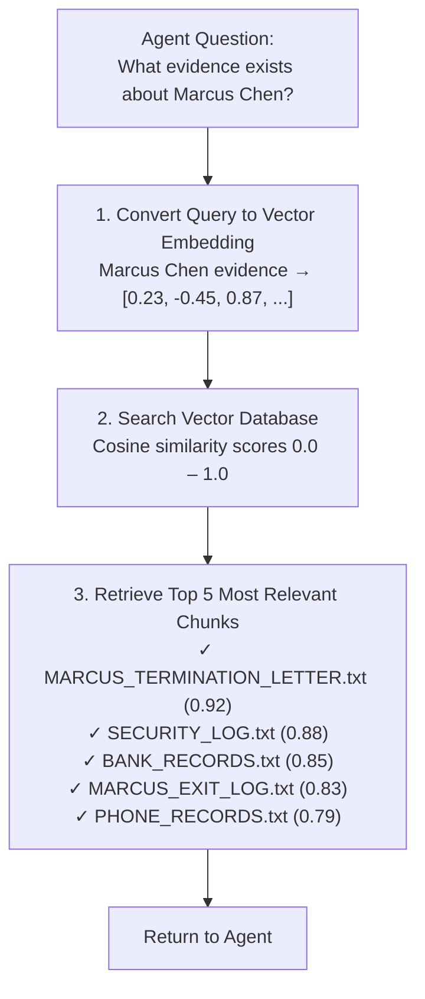
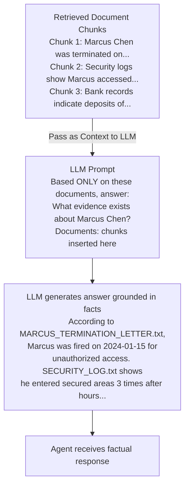

# Add the Grounding Service

## Overview

In this exercise, you will add a grounding service tool to your Evidence Analyst node. The grounding service retrieves relevant information from evidence documents to help the agent analyze the crime. You'll learn how to integrate external data sources into your LangGraph workflow using the SAP Cloud SDK for AI's `OrchestrationClient`.

---

## Understand the Grounding Service

### What is Grounding?

**Grounding** (also called **RAG — Retrieval-Augmented Generation**) connects Large Language Models to external, up-to-date data sources, giving them access to facts they weren't trained on. It solves one of AI's biggest problems: **hallucination**.

| **Without Grounding**                      | **With Grounding**                                                  |
| ------------------------------------------ | ------------------------------------------------------------------- |
| ❌ LLM makes up plausible-sounding "facts" | ✅ LLM retrieves real documents first                               |
| ❌ No source citations                     | ✅ Cites specific documents (e.g., "MARCUS_TERMINATION_LETTER.txt") |
| ❌ Can't access recent or private data     | ✅ Accesses your latest documents (evidence, contracts, logs)       |
| ❌ Unreliable for critical decisions       | ✅ Factual, auditable, trustworthy                                  |

**Example in Our Case:**

**Ungrounded Agent (BAD):**

> "Marcus Chen was likely fired due to performance issues common in the tech industry. He probably had financial troubles."
> _(Pure hallucination: sounds convincing but is made up!)_

**Grounded Agent (GOOD):**

> "According to MARCUS_TERMINATION_LETTER.txt, Marcus Chen was terminated on 2024-01-15 due to 'unauthorized access to secured areas.' BANK_RECORDS.txt shows large cash deposits of €50,000 on 2024-01-20."
> _(Facts retrieved from actual documents with sources!)_

### The Problem We're Solving

Your **Evidence Analyst** node needs to investigate suspects by examining real evidence:

**Available Evidence Documents:**

- 📄 **BANK_RECORDS.txt** - Financial transactions of all suspects
- 📄 **SECURITY_LOG.txt** - Museum access logs with timestamps
- 📄 **PHONE_RECORDS.txt** - Call history between suspects
- 📄 **MARCUS_TERMINATION_LETTER.txt** - Why Marcus was fired
- 📄 **MARCUS_EXIT_LOG.txt** - Marcus's building access records
- 📄 **SOPHIE_LOAN_DOCUMENTS.txt** - Sophie's financial situation
- 📄 **VIKTOR_CRIMINAL_RECORD.txt** - Viktor's past convictions
- 📄 **STOLEN_ITEMS_INVENTORY.txt** - Details of stolen art

**The Challenge:** These documents exist in a vector database, but your agent can't access them yet. Without grounding, the agent fabricates evidence, which is catastrophic for an investigation.

### How SAP Grounding Service Works

The SAP Generative AI Hub **Grounding Service** uses RAG in three phases:

#### Phase 1: Document Preparation (✅ Already Completed)

Before your agent can search documents, they must be prepared:

1. **Upload Documents** → Evidence files uploaded to SAP Object Store (S3 bucket)
2. **Chunk Documents** → Large documents split into smaller chunks (e.g., 500-word passages)
   - Why? LLMs have context limits; chunks are manageable pieces
   - Example: "MARCUS_TERMINATION_LETTER.txt" (5 pages) → 3 chunks
3. **Create Embeddings** → Each chunk converted to a vector (array of ~1,536 numbers)
   - Why? Computers can't search text semantically; vectors enable "meaning-based" search
   - Example: "unauthorized access" and "broke into secure area" have similar vectors
4. **Store in Vector Database** → Embeddings indexed for lightning-fast similarity search

> 💡 **Good news:** This has been done for you! The evidence documents are already processed and stored in a grounding pipeline.

#### Phase 2: Query Processing (What Your Agent Does)



> ⚡ **Speed:** Vector search is incredibly fast — searches millions of documents in milliseconds!

#### Phase 3: Context-Enhanced Response



> 🎯 **Key Insight:** The LLM can **only** use information from the retrieved chunks; it cannot fabricate information outside what was retrieved.

### The Grounding Pipeline

SAP AI Core uses **pipelines** to orchestrate the entire grounding workflow. Think of a pipeline as a pre-configured "document search engine" for your agents.

**A Pipeline Contains:**

| Component                | Purpose                        | Example                                  |
| ------------------------ | ------------------------------ | ---------------------------------------- |
| **Data Repository**      | Where documents are stored     | S3 bucket: `evidence-documents`          |
| **Embedding Model**      | Converts text to vectors       | `text-embedding-ada-002` (OpenAI)        |
| **Vector Database**      | Stores and searches embeddings | SAP Vector Engine                        |
| **Search Configuration** | Search parameters              | `max_chunk_count: 5` (return top 5 chunks) |
| **Pipeline ID**          | Unique identifier              | `0d3b132a-cbe1-4c75-abe7-adfbbab7e002`   |

**For This Exercise:**

- ✅ A pipeline is **already created** with all 8 evidence documents
- ✅ Documents are **already embedded** and indexed
- ✅ All you need to do is **connect your agent** using the Pipeline ID

> 💡 **Why Pre-Configured?** Document processing and embedding creation can take time and cost money. This setup has been done for you so you can focus on building agents!

### Why This Matters for Your Investigation

With the grounding service, your Evidence Analyst transforms from guessing to investigating:

| Capability                       | Impact                                                    |
| -------------------------------- | --------------------------------------------------------- |
| ✅ **Search Actual Evidence**    | No more made-up "facts" — only real documents             |
| ✅ **Find Suspects' Details**    | Alibis, motives, timelines, connections backed by sources |
| ✅ **Cite Specific Sources**     | "According to BANK_RECORDS.txt..." builds trust           |
| ✅ **Avoid Hallucination**       | LLM can't invent information — only uses retrieved chunks |
| ✅ **Make Informed Conclusions** | Decisions based on facts, not patterns from training data |
| ✅ **Audit Trail**               | Every answer traceable to source documents (compliance!)  |

**Before Grounding:**

- Agent: "I think Marcus might be involved because..."
- Reliability: ~30% (pure guesswork)

**After Grounding:**

- Agent: "SECURITY_LOG.txt shows Marcus accessed gallery 2C at 23:47 on the night of the theft..."
- Reliability: ~95% (fact-based, verifiable)

### RAG vs. Fine-Tuning: Why Grounding is Better

You might wonder: "Why not just fine-tune the LLM on our evidence documents?"

| Fine-Tuning                                 | Grounding (RAG)                      |
| ------------------------------------------- | ------------------------------------ |
| ❌ Expensive ($1000s per training run)      | ✅ Cost-effective (pay per search)   |
| ❌ Weeks to retrain when documents update   | ✅ Instant — just add/update documents |
| ❌ Black box — can't trace answers to sources | ✅ Full transparency with citations  |
| ❌ Model "memorizes" data (privacy risk)    | ✅ Documents stay separate (secure)  |
| ❌ Requires ML expertise                    | ✅ Simple API calls                  |

> 🎯 **Best Practice:** Use grounding for knowledge that changes (evidence, documents, data). Use fine-tuning for behaviour/style (e.g., "always be polite").

### How Grounding Works in the SAP Cloud SDK for AI

In TypeScript, you configure grounding directly in the `OrchestrationClient` definition. The orchestration pipeline handles:
1. Converting the user's question to a vector embedding
2. Searching the vector database
3. Injecting the retrieved chunks into the LLM prompt
4. Returning the grounded response

No separate retrieval API client is needed; it's all built into `OrchestrationClient`.

---

## Access the Grounding Pipeline in SAP AI Launchpad

👉 Open [SAP AI Launchpad](https://genai-codejam-luyq1wkg.ai-launchpad.prod.eu-central-1.aws.ai-prod.cloud.sap/aic/index.html#/workspaces&/a/detail/TwoColumnsMidExpanded/?workspace=api-connection&resourceGroup=s3-grounding)

#### Select the Resource Group

SAP AI Core tenants use [resource groups](https://help.sap.com/docs/sap-ai-core/sap-ai-core-service-guide/resource-groups) to isolate AI resources and workloads. Scenarios and executables are shared across all resource groups within the instance, but deployments and configurations are scoped to a specific resource group.

> DO NOT USE THE DEFAULT `default` RESOURCE GROUP!

👉 Go to **Workspaces** → Select your workspace → resource group `ai-agents-codejam`.

#### Explore the Grounding Pipeline

👉 Go to **Generative AI Hub > Grounding Management**

👉 Open the existing pipeline

Here you'll see:
- **Pipeline Name** — Identifies this grounding configuration
- **Pipeline ID** — The unique identifier you'll use in code (☝️ **Copy this!**)
- **Data Repository** — The storage containing evidence documents
- **Embedding Model** — The AI model converting text to vectors
- **Search Configuration** — Parameters like chunk size and retrieval count

👉 (Optional) Click `Run Search` to test the pipeline. Try searching for "Marcus Chen" or "Sophie Dubois".

☝️ **Important**: Copy the **Pipeline ID**; you'll need it in the next step.

---

## Add the Grounding Service to Your Workflow

### Step 1: Build the Grounding Tool Function

In the SAP Cloud SDK for AI, grounding is configured as part of `OrchestrationClient`. You create a dedicated client for grounding with the pipeline configuration baked in, then use it in your tool function.

👉 Open [`/project/JavaScript/starter-project/src/tools.ts`](/project/JavaScript/starter-project/src/tools.ts)

👉 Add the grounding client and tool function:

```typescript
import { OrchestrationClient } from '@sap-ai-sdk/orchestration'

const groundingClient = new OrchestrationClient(
    {
        llm: {
            model_name: process.env.MODEL_NAME!,
            model_params: {},
        },
        templating: {
            template: [
                {
                    role: 'system',
                    content: 'Use the following context to answer the question:\n{{?groundingOutput}}',
                },
                { role: 'user', content: '{{?user_question}}' },
            ],
        },
        grounding: {
            type: 'document_grounding_service',
            config: {
                filters: [
                    {
                        id: 'vector',
                        data_repository_type: 'vector',
                        data_repositories: [process.env.GROUNDING_PIPELINE_ID!], // 👈 Add to .env
                        search_config: {
                            max_chunk_count: 5,
                        },
                    },
                ],
                input_params: ['user_question'],
                output_param: 'groundingOutput',
            },
        },
    },
    { resourceGroup: process.env.RESOURCE_GROUP },
)

export async function callGroundingServiceTool(user_question: string): Promise<string> {
    try {
        const response = await groundingClient.chatCompletion({
            inputParams: { user_question },
        })
        return response.getContent() ?? 'No response from grounding service'
    } catch (error) {
        const errorMessage = error instanceof Error ? error.message : String(error)
        console.error('❌ Grounding service call failed:', errorMessage)
        return `Error calling grounding service: ${errorMessage}`
    }
}
```

> 💡 **Understanding the grounding configuration:**
>
> **The template** defines the prompt structure with two special placeholders:
> - `{{?user_question}}` — replaced with the user's question at call time (defined in `input_params`)
> - `{{?groundingOutput}}` — replaced with the retrieved document chunks (defined in `output_param`)
>
> The `?` in `{{?variable}}` is required: it marks these as template parameters. Without it, the API returns a 400 error about "unused parameters".
>
> **The grounding config:**
> - `data_repositories: [process.env.GROUNDING_PIPELINE_ID!]` — points to your specific evidence pipeline
> - `max_chunk_count: 5` — retrieve the top 5 most relevant document chunks
> - `input_params: ['user_question']` — the template variable that carries the query into the retrieval system
> - `output_param: 'groundingOutput'` — the template variable where retrieved chunks are injected
>
> **Why `inputParams` in `chatCompletion`?**
>
> When using templating, you pass the template variable values via `inputParams` instead of `messages`. The SDK renders the template with these values before sending to the LLM:
> ```typescript
> // With templating — pass variable values
> groundingClient.chatCompletion({ inputParams: { user_question } })
>
> // Without templating — pass messages directly
> orchestrationClient.chatCompletion({ messages: [...] })
> ```

### Step 2: Add the Pipeline ID to .env

👉 Add your grounding pipeline ID to the `.env` file in the starter project:

```bash
GROUNDING_PIPELINE_ID="your-pipeline-id-here"
```

### Step 3: Connect the Tool to the Evidence Analyst Node

👉 Open [`/project/JavaScript/starter-project/src/investigationWorkflow.ts`](/project/JavaScript/starter-project/src/investigationWorkflow.ts)

👉 Import the grounding tool:

```typescript
import { callRPT1Tool, callGroundingServiceTool } from './tools.js'
```

👉 Update the `evidenceAnalystNode` to use the grounding service:

```typescript
    private async evidenceAnalystNode(state: AgentState): Promise<Partial<AgentState>> {
        console.log('\n🔍 Evidence Analyst starting...')

        try {
            const suspects = state.suspect_names.split(',').map(s => s.trim())
            const evidenceResults: string[] = []

            for (const suspect of suspects) {
                console.log(`  Searching evidence for: ${suspect}`)
                const query = `Find evidence and information about ${suspect} related to the art theft`
                const result = await callGroundingServiceTool(query)
                evidenceResults.push(`Evidence for ${suspect}:\n${result}`)
            }

            const evidenceAnalysis = `Evidence Analysis Complete: ${evidenceResults.join('\n\n')}
      Summary: Analyzed evidence for all suspects: ${state.suspect_names}`

            console.log('✅ Evidence analysis complete')

            return {
                evidence_analysis: evidenceAnalysis,
                messages: [...state.messages, { role: 'assistant', content: evidenceAnalysis }],
            }
        } catch (error) {
            const errorMsg = error instanceof Error ? error.message : String(error)
            console.error('❌ Evidence analysis failed:', errorMsg)
            if (error instanceof Error && error.stack) {
                console.error(error.stack)
            }
            return {
                evidence_analysis: `Error during evidence analysis: ${errorMsg}`,
                messages: [
                    ...state.messages,
                    { role: 'assistant', content: `Error during evidence analysis: ${errorMsg}` },
                ],
            }
        }
    }
```

### Step 4: Run Your Workflow with the Grounding Service

```bash
npx tsx src/main.ts
```

Your Evidence Analyst should now search through actual evidence documents and cite specific sources (like "MARCUS_TERMINATION_LETTER.txt") instead of producing placeholder output!

---

## Understanding the Grounding Service

### What Just Happened?

You integrated a grounding tool that:

1. **Accepts** a question from the evidence analyst node
2. **Sends** the question to `OrchestrationClient` with the grounding configuration
3. **Automatically** embeds the question and retrieves the top 5 relevant document chunks from the vector database
4. **Injects** the document chunks into the LLM prompt via `{{?groundingOutput}}`
5. **Returns** a response grounded in real evidence documents

### Grounding in SAP Cloud SDK vs Python SDK

The grounding approach differs between the Python and TypeScript SDKs:

| Python (gen_ai_hub)                    | TypeScript (SAP Cloud SDK for AI)                       |
|----------------------------------------|---------------------------------------------------------|
| `RetrievalAPIClient` + manual search   | Built into `OrchestrationClient` configuration          |
| Returns raw JSON document chunks       | Returns LLM response with chunks injected as context    |
| Agent receives JSON and reasons on it  | LLM reasons on chunks and returns a natural answer      |
| More control over retrieval            | Simpler setup, fully managed pipeline                   |

In the TypeScript approach, the orchestration pipeline handles the retrieval **and** the LLM response in one call. You get a polished natural language answer instead of raw JSON chunks.

---

## Key Takeaways

- **Grounding in SAP Cloud SDK for AI** is configured directly in `OrchestrationClient` — no separate retrieval client needed
- **`{{?variable}}` syntax** (with `?`) is required for template parameters — the `?` marks them as template placeholders
- **`inputParams`** in `chatCompletion()` passes template variable values when using the templating feature
- **Module-level client initialization** prevents repeated SDK warnings when the grounding tool is called in a loop
- **`response.getContent()`** extracts the LLM's text response. Never use `JSON.stringify()` on the response object itself (it contains HTTP connection references that cause circular structure errors).

---

## Next Steps

1. ✅ [Understand Generative AI Hub](00-understanding-genAI-hub.md)
2. ✅ [Set up your development space](01-setup-dev-space.md)
3. ✅ [Build a basic agent](02-build-a-basic-agent.md)
4. ✅ [Add custom tools](03-add-your-first-tool.md) to your agents
5. ✅ [Build a multi-agent workflow](04-building-multi-agent-system.md)
6. ✅ Integrate the Grounding Service (this exercise)
7. 📌 [Solve the museum art theft mystery](06-solve-the-crime.md) using your fully-featured agent team

---

## Troubleshooting

**Issue**: `400 Bad Request — Unused parameters: groundingOutput`

- **Solution**: Ensure your template uses `{{?groundingOutput}}` (with the `?`). Without the `?`, the variable is treated as a literal string, not a template parameter, causing the API to report it as unused.

**Issue**: Grounding returns generic responses without citing documents

- **Solution**: Verify your `GROUNDING_PIPELINE_ID` is correct. Test the pipeline in SAP AI Launchpad's Grounding Management to confirm documents are indexed.

**Issue**: `TypeError: Converting circular structure to JSON`

- **Solution**: You're trying to `JSON.stringify()` the entire `OrchestrationResponse` object. Use `response.getContent()` instead to extract just the text content.

**Issue**: `inputParams is not a valid property`

- **Solution**: Make sure you're using the correct overload of `chatCompletion()`. When using templating, pass `{ inputParams: { user_question } }` instead of `{ messages: [...] }`.

**Issue**: Evidence analyst logs show suspect names out of order

- **Solution**: The `for...of` loop is sequential (not concurrent), so logs appear in order. If logs seem interleaved, it's SDK initialization messages; this is resolved by initializing `groundingClient` at module level rather than inside the function.

---

## Resources

- [SAP AI Core Grounding Management](https://help.sap.com/docs/sap-ai-core/sap-ai-core-service-guide/document-grounding)
- [SAP Cloud SDK for AI — Orchestration Package](https://github.com/SAP/ai-sdk-js/tree/main/packages/orchestration)
- [LangGraph.js Documentation](https://langchain-ai.github.io/langgraphjs/)

[Next exercise](06-solve-the-crime.md)
