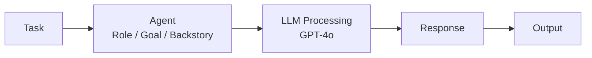

# Build your first AI Agent

For this CodeJam, you will build three agents (Stolen Goods Loss Appraiser, Criminal Evidence Analyst and Lead Detective). Each of these agents will take an active part in solving a burglary and executing a loss appraisal for an insurance claim.

After any good burglary you need a loss appraiser who determines the insurance claims. That will be the first agent you are going to build.

---

## Overview

In this exercise, you will build an agent with Python, LiteLLM, SAP Cloud SDK for AI and CrewAI.

[**LiteLLM**](https://docs.litellm.ai/docs/) is a library that provides a unified, provider-agnostic API for calling large language models (LLMs) and handling common tasks (completion, chat, streaming, multimodal inputs). It standardizes request/response handling and includes utilities that speed up integration with agent frameworks and tooling. Essentially it is a gateway between LLM providers and AI Agent frameworks.

That means you can use your Generative AI Hub credentials to build state of the art AI Agents with any of the models available through GenAI Hub and any of the AI Agent frameworks compatible with LiteLLM. This combination is extremely powerful because that means you can use LLMs hosted, managed by SAP (Mistral, Llama, Nvidia), and models from our partners such as Azure OpenAI, Amazon Bedrock (including Anthropic) and Gemini.

[**SAP Cloud SDK for AI**](https://help.sap.com/doc/generative-ai-hub-sdk/CLOUD/en-US/index.html) is SAP's official Python SDK for interacting with SAP AI Core and the Generative AI Hub. It provides convenient clients and utilities for tasks such as document grounding, embeddings, retrieval and model predictions — including SAP's own RPT-1 model. In later exercises you will use the SDK to integrate SAP-RPT-1 and the Grounding Service into your agents, giving them the ability to retrieve and reason over data.

[**CrewAI**](https://crewai.com/) is a third-party open-source Python library. As the name suggests you can use it to build a crew of agents that have a set of tools available to accomplish certain tasks. CrewAI uses tasks to bridge the gap between high-level goals and concrete agent actions, assigning specific objectives and expected outputs. You will use CrewAI as the AI Agent framework for your agents going forward. For now your agent will only be able to respond to incoming queries.

---

## Create a Basic Agent

### Step 1: Import Libraries and Load Environmental Variables

👉 Create a new file [`/project/Python/starter-project/basic_agent.py`](/project/Python/starter-project/basic_agent.py) (You can just click on the file link to create the file)

👉 Add the following lines of code to import the necessary packages and load the infos from your environment (.env) file:

```python
import os
from pathlib import Path
from dotenv import load_dotenv
from crewai import Agent, Task, Crew

# Load .env from the same directory as this script
env_path = Path(__file__).parent / '.env'
load_dotenv(dotenv_path=env_path)
```

### Step 2: Building the Agent

Every agent needs to have at least a **role**, a **goal**, and a **backstory**.

- **Role**: Defines the agent's identity and expertise domain (e.g., "Loss Appraiser", "Detective"). This shapes how the agent approaches tasks.
- **Goal**: Specifies what the agent should accomplish. A clear goal helps the LLM stay focused on the desired outcome.
- **Backstory**: Provides context and personality to the agent, influencing its reasoning style and decision-making approach.

Important is also the parameter **llm**. Here you can specify which model provider and which LLM you want to use (syntax: **provider/llm**). We will specify `sap` as the LLM provider with over 30 models to pick from. LiteLLM is directing calls to the LLMs through the orchestration service of `Generative AI Hub`. That means you do not need to deploy your models on SAP AI Core. You only need the out of the box deployment of the orchestration service. This way you can easily switch between all the models available via the orchestration service.

👉 Below that add the code for your first agent

```python
# Create a Loss Appraiser Agent
appraiser_agent = Agent(
    role="Stolen Goods Loss Appraiser",
    goal="Assess the value of stolen items and provide a professional insurance appraisal report.",
    backstory="You are an experienced insurance appraiser specializing in fine art and valuables. You provide detailed assessments based on your expertise.",
    llm="sap/gpt-4o",  # provider/llm - Using one of the models from SAP's model library in Generative AI Hub
    verbose=True
)
```

> 👆 You might have noticed that the properties of the agent are defined in natural language. This is because the LLM is reading the properties of the agent in natural language to understand what the agent does, what it goal is and it's goal.

### Step 3: Configuring a Task

Every CrewAI agent needs at least one task, otherwise the agent will be inactive. Necessary parameters to fill are **description**, **expected_output** and **agent**.

```python
# Create a task for the appraiser
appraise_loss_task = Task(
    description="Provide a brief explanation of how an insurance appraiser would approach assessing stolen artwork and valuables.",
    expected_output="A professional explanation of the appraisal process.",
    agent=appraiser_agent
)
```

> 👆 The task description is written in natural language for the **LLM** (GPT-4o) to read and understand. The LLM acts as the reasoning engine that interprets instructions and generates appropriate responses based on the agent's role, goal, and backstory.

### Step 4: Create the Crew and Add Your Agent

Every crew needs to have at least one agent with at least one associated task. Both of which you defined above.

👉 Add your agent to a crew

```python
# Create a crew with the appraiser agent
crew = Crew(
    agents=[appraiser_agent],
    tasks=[appraise_loss_task],
    verbose=True
)

# Execute the crew
def main():
    result = crew.kickoff()
    print("\n" + "="*50)
    print("Insurance Appraiser Report:")
    print("="*50)
    print(result)

if __name__ == "__main__":
    main()
```

---

### Step 5: Run Your Agent

👉 Execute the crew with the basic agent:

> ☝️ Make sure you're in the repository root directory (e.g., `codejam-code-based-agents-1`) when running this command. If you're already in the `starter-project` folder, use the appropriate command for your OS.

**From repository root:**

```bash
# macOS / Linux / BAS
python3 ./basic_agent.py
```

```powershell
# Windows (PowerShell)
python .\basic_agent.py
```

```cmd
# Windows (Command Prompt)
python .\basic_agent.py
```

**From starter-project folder:**

```bash
# macOS / Linux
python3 basic_agent.py
```

```powershell
# Windows (PowerShell)
python basic_agent.py
```

```cmd
# Windows (Command Prompt)
python basic_agent.py
```

You should see:

- The appraiser agent thinking through the task
- A professional explanation of the appraisal process

> 👆 At the moment the LLM is just hallucinating because the actual RPT-1 tool is not defined yet. You will implement this in the next exercise.

---

## Understanding Your First Agent

### What Just Happened?

You created and ran a working AI agent that:

1. **Agent Definition**: Has a role, goal, and backstory that defines its identity and expertise
2. **Task Processing**: Received a task description and used the LLM to generate an appropriate response
3. **Crew Execution**: Ran the agent through CrewAI's orchestration framework

The basic workflow is:



---

## Key Takeaways

- **AI Agents** are autonomous systems that perceive, reason, and act
- **CrewAI** provides a structured framework with agents, tasks, and crews
- **LiteLLM** acts as a gateway between agent frameworks and LLM providers
- **SAP Cloud SDK for AI** provides Python clients for SAP AI Core services like document grounding and RPT-1
- **Generative AI Hub on SAP AI Core** acts as a provider and powers agents with LLMs

---

## Next Steps

In the following exercises, you will:

1. ✅ Build a basic agent (this exercise)
2. 📌 [Add custom tools](03-add-your-first-tool.md) to your agents so they can access external data
3. 📌 Create a complete crew with multiple agents working together
4. 📌 Integrate the Grounding Service for better reasoning and fact-checking
5. 📌 Solve the museum art theft mystery using your fully-featured agent team

---

## Troubleshooting

**Issue**: `ModuleNotFoundError: No module named 'crewai'`

- **Solution**: Ensure you're in the correct Python environment and run the install command.

```bash
# macOS / Linux - Activate environment and install
source ~/projects/codejam-code-based-agents/env/bin/activate
pip install crewai litellm
```

```powershell
# Windows (PowerShell) - Activate environment and install
.\env\Scripts\Activate.ps1
pip install crewai litellm
```

```cmd
# Windows (Command Prompt) - Activate environment and install
.\env\Scripts\activate.bat
pip install crewai litellm
```

---

## Resources

- [CrewAI GenAI Hub Examples](https://sap-contributions.github.io/litellm-agentic-examples/_notebooks/examples/crewai_litellm_lib.html)
- [CrewAI Documentation](https://docs.crewai.com/)
- [SAP Generative AI Hub](https://help.sap.com/docs/sap-ai-core/sap-ai-core-service-guide/generative-ai-hub-in-sap-ai-core-7db524ee75e74bf8b50c167951fe34a5)
- [LiteLLM Documentation](https://docs.litellm.ai/)
- [SAP Cloud SDK for AI Documentation](https://help.sap.com/doc/generative-ai-hub-sdk/CLOUD/en-US/index.html)

[Next exercise](03-add-your-first-tool.md)
