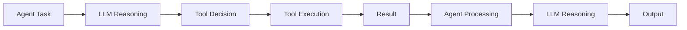

# Add Your First Tool to the Agent

In the previous exercise, you built a basic agent that could reason and respond using an LLM. Now you'll extend it with a **tool** that allows the agent to call external services and work with structured data.

---

## Overview

In this exercise, you will add an input variable and a tool to your agent. You will give the agent the SAP-RPT-1 model as a tool to make predictions on structured data.

> **SAP-RPT-1** [SAP's Relational Pretrained Transformer model](https://www.sap.com/products/artificial-intelligence/sap-rpt.html) is a foundation model trained on structured data. It is available in the Generative AI Hub to gain predictive insights from enterprise data without building models from scratch. The model works by uploading a couple of example data rows as .json or .csv files and can do classification as well as regression predictions on your dataset.

---

## Check out SAP-RPT-1

👉 Open the [SAP-RPT-1 Playground](https://rpt.cloud.sap/). Use one of the example files from the playground to understand how the model works.

---

## Add an Input Variable to Your Agent

In order for the agent to run predictions on actual data, you need to be able to pass input data.

### Step 1: Update the Agent and Task to Reference the Tool and Data

👉 Navigate to your [`basic_agent.py`](/project/Python/starter-project/basic_agent.py) file.

👉 Update the agent's goal and task description to reference the `call_rpt1` tool and a `payload` variable. Add `{payload}` to the strings and convert them to **f-strings** (formatted strings) by adding `f` to the beginning.

Make the following changes to the agent and task defintion:

```python
# Create a Loss Appraiser Agent
appraiser_agent = Agent(
    role="Loss Appraiser",
    goal=f"Predict the missing values of stolen items using the RPT-1 model via the call_rpt1 tool use this payload {payload} as input.",
    backstory="You are an expert insurance appraiser specializing in fine art valuation and theft assessment.",
    llm="sap/gpt-4o",  # provider/llm - Using one of the models from SAP's model library in Generative AI Hub
    verbose=True
)

# Create a task for the appraiser
appraise_loss_task = Task(
    description=f"Analyze the theft crime scene and predict the missing values of stolen items using the RPT-1 model via the call_rpt1 tool. Use this dict {payload} as input.",
    expected_output="JSON with predicted values for the stolen items.",
    agent=appraiser_agent
)
```

---

### Step 2: Create the Payload Data File

Now we need to create the `payload` variable that we referenced in the agent's goal. Instead of cluttering our main file, we'll keep the data in a separate file for better organization.

👉 Create a new file called [`payload.py`](/project/Python/starter-project/payload.py) in the `starter-project` folder.

👉 Add the payload data to this file:

```python
# Payload data for stolen items appraisal
payload = {
        "prediction_config": {
            "target_columns": [
                {
                    "name": "INSURANCE_VALUE",
                    "prediction_placeholder": "[PREDICT]",
                    "task_type": "regression",
                },
                {
                    "name": "ITEM_CATEGORY",
                    "prediction_placeholder": "[PREDICT]",
                    "task_type": "classification",
                },
            ]
        },
        "index_column": "ITEM_ID",
        "rows": [
            {
                "ITEM_ID": "ART_001",
                "ITEM_NAME": "Water Lilies - Series 1",
                "ARTIST": "Claude Monet",
                "ACQUISITION_DATE": "1987-03-15",
                "INSURANCE_VALUE": 45000000,
                "ITEM_CATEGORY": "Painting",
                "DIMENSIONS": "200x180cm",
                "CONDITION_SCORE": 9,
                "RARITY_SCORE": 9,
                "PROVENANCE_CLARITY": 8,
            },
            {
                "ITEM_ID": "ART_002",
                "ITEM_NAME": "Japanese Bridge at Giverny",
                "ARTIST": "Claude Monet",
                "ACQUISITION_DATE": "1995-06-22",
                "INSURANCE_VALUE": 42000000,
                "ITEM_CATEGORY": "Painting",
                "DIMENSIONS": "92x73cm",
                "CONDITION_SCORE": 8,
                "RARITY_SCORE": 8,
                "PROVENANCE_CLARITY": 9,
            },
            {
                "ITEM_ID": "ART_003",
                "ITEM_NAME": "Irises",
                "ARTIST": "Vincent van Gogh",
                "ACQUISITION_DATE": "2001-11-08",
                "INSURANCE_VALUE": "[PREDICT]",
                "ITEM_CATEGORY": "Painting",
                "DIMENSIONS": "71x93cm",
                "CONDITION_SCORE": 7,
                "RARITY_SCORE": 9,
                "PROVENANCE_CLARITY": 8,
            },
            {
                "ITEM_ID": "ART_004",
                "ITEM_NAME": "Starry Night Over the Rhone",
                "ARTIST": "Vincent van Gogh",
                "ACQUISITION_DATE": "1998-09-14",
                "INSURANCE_VALUE": 48000000,
                "ITEM_CATEGORY": "Painting",
                "DIMENSIONS": "73x92cm",
                "CONDITION_SCORE": 8,
                "RARITY_SCORE": 9,
                "PROVENANCE_CLARITY": 9,
            },
            {
                "ITEM_ID": "ART_005",
                "ITEM_NAME": "The Birth of Venus",
                "ARTIST": "Sandro Botticelli",
                "ACQUISITION_DATE": "1992-04-30",
                "INSURANCE_VALUE": 55000000,
                "ITEM_CATEGORY": "Painting",
                "DIMENSIONS": "172x278cm",
                "CONDITION_SCORE": 6,
                "RARITY_SCORE": 10,
                "PROVENANCE_CLARITY": 10,
            },
            {
                "ITEM_ID": "ART_006",
                "ITEM_NAME": "Primavera",
                "ARTIST": "Sandro Botticelli",
                "ACQUISITION_DATE": "1989-02-19",
                "INSURANCE_VALUE": 52000000,
                "ITEM_CATEGORY": "Painting",
                "DIMENSIONS": "203x314cm",
                "CONDITION_SCORE": 7,
                "RARITY_SCORE": 10,
                "PROVENANCE_CLARITY": 10,
            },
            {
                "ITEM_ID": "ART_007",
                "ITEM_NAME": "Girl with a Pearl Earring",
                "ARTIST": "Johannes Vermeer",
                "ACQUISITION_DATE": "2003-07-11",
                "INSURANCE_VALUE": "[PREDICT]",
                "ITEM_CATEGORY": "Painting",
                "DIMENSIONS": "44x39cm",
                "CONDITION_SCORE": 8,
                "RARITY_SCORE": 10,
                "PROVENANCE_CLARITY": 9,
            },
            {
                "ITEM_ID": "ART_008",
                "ITEM_NAME": "The Music Lesson",
                "ARTIST": "Johannes Vermeer",
                "ACQUISITION_DATE": "1994-05-20",
                "INSURANCE_VALUE": 38000000,
                "ITEM_CATEGORY": "Painting",
                "DIMENSIONS": "64x73cm",
                "CONDITION_SCORE": 8,
                "RARITY_SCORE": 9,
                "PROVENANCE_CLARITY": 9,
            },
            {
                "ITEM_ID": "ART_009",
                "ITEM_NAME": "The Persistence of Memory",
                "ARTIST": "Salvador Dalí",
                "ACQUISITION_DATE": "2005-03-10",
                "INSURANCE_VALUE": 35000000,
                "ITEM_CATEGORY": "[PREDICT]",
                "DIMENSIONS": "24x33cm",
                "CONDITION_SCORE": 9,
                "RARITY_SCORE": 9,
                "PROVENANCE_CLARITY": 10,
            },
            {
                "ITEM_ID": "ART_010",
                "ITEM_NAME": "Metamorphosis of Narcissus",
                "ARTIST": "Salvador Dalí",
                "ACQUISITION_DATE": "1996-08-12",
                "INSURANCE_VALUE": 32000000,
                "ITEM_CATEGORY": "Painting",
                "DIMENSIONS": "51x78cm",
                "CONDITION_SCORE": 8,
                "RARITY_SCORE": 8,
                "PROVENANCE_CLARITY": 8,
            },
            {
                "ITEM_ID": "ART_011",
                "ITEM_NAME": "The Bronze Dancer",
                "ARTIST": "Auguste Rodin",
                "ACQUISITION_DATE": "1991-07-22",
                "INSURANCE_VALUE": 8500000,
                "ITEM_CATEGORY": "Sculpture",
                "DIMENSIONS": "Height: 1.8m",
                "CONDITION_SCORE": 9,
                "RARITY_SCORE": 7,
                "PROVENANCE_CLARITY": 8,
            },
            {
                "ITEM_ID": "ART_012",
                "ITEM_NAME": "The Thinker",
                "ARTIST": "Auguste Rodin",
                "ACQUISITION_DATE": "2000-11-05",
                "INSURANCE_VALUE": "[PREDICT]",
                "ITEM_CATEGORY": "Sculpture",
                "DIMENSIONS": "Height: 1.9m",
                "CONDITION_SCORE": 9,
                "RARITY_SCORE": 7,
                "PROVENANCE_CLARITY": 9,
            },
            {
                "ITEM_ID": "ART_013",
                "ITEM_NAME": "Hope Diamond Replica - Royal Cut",
                "ARTIST": "Unknown Jeweler",
                "ACQUISITION_DATE": "1988-02-19",
                "INSURANCE_VALUE": 12000000,
                "ITEM_CATEGORY": "Jewelry",
                "DIMENSIONS": "Width: 15cm",
                "CONDITION_SCORE": 10,
                "RARITY_SCORE": 10,
                "PROVENANCE_CLARITY": 7,
            },
            {
                "ITEM_ID": "ART_014",
                "ITEM_NAME": "Cartier Ruby Necklace - 1920s",
                "ARTIST": "Cartier",
                "ACQUISITION_DATE": "2002-09-11",
                "INSURANCE_VALUE": 9500000,
                "ITEM_CATEGORY": "Jewelry",
                "DIMENSIONS": "Length: 45cm",
                "CONDITION_SCORE": 9,
                "RARITY_SCORE": 8,
                "PROVENANCE_CLARITY": 9,
            },
        ],
        "data_schema": {
            "ITEM_ID": {"dtype": "string"},
            "ITEM_NAME": {"dtype": "string"},
            "ARTIST": {"dtype": "string"},
            "ACQUISITION_DATE": {"dtype": "date"},
            "INSURANCE_VALUE": {"dtype": "numeric"},
            "ITEM_CATEGORY": {"dtype": "string", "categories": ["Painting", "Sculpture", "Jewelry"]},
            "DIMENSIONS": {"dtype": "string"},
            "CONDITION_SCORE": {"dtype": "numeric", "range": [1, 10], "description": "1=Poor to 10=Pristine"},
            "RARITY_SCORE": {"dtype": "numeric", "range": [1, 10], "description": "1=Common to 10=Extremely Rare"},
            "PROVENANCE_CLARITY": {"dtype": "numeric", "range": [1, 10], "description": "1=Unknown to 10=Perfect Documentation"},
        },
    }
```

👉 Now update your `basic_agent.py` file to import the payload from this new file. Add this import at the top:

```python
from payload import payload
```

---

### Step 3: Run the Crew with Input Variables

👉 Pass your input to the crew

```python

# Execute the crew
def main():
    result = crew.kickoff(inputs={'payload': payload})
    print("\n" + "="*50)
    print("Insurance Appraiser Report:")
    print("="*50)
    print(result)

if __name__ == "__main__":
    main()
```

👉 Run your crew to test it.

> ☝️ Make sure you run from the starter-project folder, or use the full path from the repository root.

**From repository root:**

```bash
# macOS / Linux
python3 ./project/Python/starter-project/basic_agent.py
```

```powershell
# Windows (PowerShell)
python .\project\Python\starter-project\basic_agent.py
```

```cmd
# Windows (Command Prompt)
python .\project\Python\starter-project\basic_agent.py
```

**From starter-project folder:**

```bash
# macOS / Linux
python3 basic_agent.py
```

```powershell
# Windows (PowerShell)
python basic_agent.py
```

```cmd
# Windows (Command Prompt)
python basic_agent.py
```

☝️ You added an input variable to your agent but the agent is still not using a tool. Let's build the actual tool next.

---
## Add SAP-RPT-1 to Your Agent

SAP-RPT-1 can be easily accessed via SAP Cloud SDK for AI. For further information, refer to the [SAP Cloud SDK for AI Documentation](https://help.sap.com/doc/generative-ai-hub-sdk/CLOUD/en-US/_reference/gen_ai_hub.html#sap-rpt-1-models)

### Step 0: Install and Import Required SAP Cloud SDK for AI Libraries

👉 Open your terminal in the virtual environment and install the SAP AI SDK:

```bash
pip install sap-ai-sdk-gen
```

> 💡 This installs the [Cloud SDK for AI (Python)](https://help.sap.com/doc/generative-ai-hub-sdk/CLOUD/en-US/_reference/README_sphynx.html), which provides tools for document grounding, embeddings, retrieval, as well as rpt-1 predictions.

### Step 1: Build the Function for the Tool

To add a custom tool to an agent, you create a function that encapsulates the functionality you want to expose. This function will be available for the agent to call when completing its task.

👉 Import the SAP-RPT-1 client (RPTClient) from SAP Cloud SDK for AI at the top of your `basic_agent.py` file:

```python
from gen_ai_hub.proxy.native.sap.client import RPTClient
```

👉 Initialize the RPTClient after the initialization of the environment variables

```python
# Load .env from the same directory as this script
env_path = Path(__file__).parent / '.env'
load_dotenv(dotenv_path=env_path)

# Initialize RPT1 client after loading environment variables
rpt1_client = RPTClient()
```

👉 Add this code above your agent definition:

```python
def call_rpt1(payload: dict) -> str:
    """Call RPT-1 model to predict missing values in the payload.

    Args:
        payload: A dictionary containing the stolen items data with prediction placeholders.
                 This should be the exact payload provided in the task inputs.

    Returns:
        JSON string with predicted insurance values and item categories.
    """
    response = rpt1_client.predict(body=payload, model_name="sap-rpt-1-large")
    if response:
        return response.json()
    else:
        return f"Error: {response.status_code} - {response.text}"
```

### Step 2: Make the Function a Tool

👉 Add the following line of code to your import section at the top of your `basic_agent.py` file:

```python
from crewai.tools import tool
```

👉 Add the following line of code above your `call_rpt1()` function:

```python
@tool("call_rpt1")
```

The function should look like this now:

```python
@tool("call_rpt1")
def call_rpt1(payload: dict) -> str:
    """Call RPT-1 model to predict missing values in the payload.

    Args:
        payload: A dictionary containing the stolen items data with prediction placeholders.
                 This should be the exact payload provided in the task inputs.

    Returns:
        JSON string with predicted insurance values and item categories.
    """
    try:
        response = rpt1_client.predict(body=payload, model_name="sap-rpt-1-large")
        if response:
            import json
            return json.dumps(response.json(), indent=2)
        else:
            return f"Error {response.status_code}: {response.text}"
    except Exception as e:
        return f"Error calling RPT-1: {str(e)}"
```

### Step 3: Add the Tool to Your Agent

👉 Add the following line of code to your agent definition:

```python
tools=[call_rpt1],
```

Your agent defintion should look like this now:

```python
# Create a Loss Appraiser Agent
appraiser_agent = Agent(
    role="Loss Appraiser",
    goal=f"Predict the missing values of stolen items using the RPT-1 model via the call_rpt1 tool use this payload {payload} as input.",
    backstory="You are an expert insurance appraiser specializing in fine art valuation and theft assessment.",
    llm="sap/gpt-4o",  # provider/llm - Using one of the models from SAP's model library in Generative AI Hub
    tools=[call_rpt1],
    verbose=True
)
```

👉 Your code in `basic_agent.py` should now look like this:

```python
import os
from pathlib import Path
from dotenv import load_dotenv
from crewai import Agent, Task, Crew
from crewai.tools import tool
from gen_ai_hub.proxy.native.sap.client import RPTClient
from payload import payload


# Load .env from the same directory as this script
env_path = Path(__file__).parent / '.env'
load_dotenv(dotenv_path=env_path)

# Initialize RPT1 client after loading environment variables
rpt1_client = RPTClient()

@tool("call_rpt1")
def call_rpt1(payload: dict) -> str:
    """Call RPT-1 model to predict missing values in the payload.

    Args:
        payload: A dictionary containing the stolen items data with prediction placeholders.
                 This should be the exact payload provided in the task inputs.

    Returns:
        JSON string with predicted insurance values and item categories.
    """
    response = rpt1_client.predict(body=payload, model_name="sap-rpt-1-large")
    if response:
        return response.json()
    else:
        return f"Error: {response.status_code} - {response.text}"

# Create a Loss Appraiser Agent
appraiser_agent = Agent(
    role="Loss Appraiser",
    goal=f"Predict the missing values of stolen items using the RPT-1 model via the call_rpt1 tool use this payload {payload} as input.",
    backstory="You are an expert insurance appraiser specializing in fine art valuation and theft assessment.",
    llm="sap/gpt-4o",  # provider/llm - Using one of the models from SAP's model library in Generative AI Hub
    tools=[call_rpt1],
    verbose=True
)

# Create a task for the appraiser
appraise_loss_task = Task(
    description=f"Analyze the theft crime scene and predict the missing values of stolen items using the RPT-1 model via the call_rpt1 tool. Use this dict {payload} as input.",
    expected_output="JSON with predicted values for the stolen items.",
    agent=appraiser_agent
)

# Create a crew with the appraiser agent
crew = Crew(
    agents=[appraiser_agent],
    tasks=[appraise_loss_task],
    verbose=True
)

# Execute the crew
def main():
    result = crew.kickoff(inputs={'payload': payload})
    print("\n" + "="*50)
    print("Insurance Appraiser Report:")
    print("="*50)
    print(result)

if __name__ == "__main__":
    main()
```

### Step 4: Update the .env File with the Correct SAP-RPT-1 URL

👉 Go to [SAP AI Launchpad](https://genai-codejam-luyq1wkg.ai-launchpad.prod.eu-central-1.aws.ai-prod.cloud.sap/aic/index.html#/workspaces&/a/detail/TwoColumnsMidExpanded/?workspace=api-connection&resourceGroup=s3-grounding)

☝️ In this subaccount the connection between the SAP AI Core service instance and the SAP AI Launchpad application is already established. Otherwise you would have to add a new AI runtime using the SAP AI Core service key information.

> DO NOT USE THE `default` RESOURCE GROUP!

👉 Go to **Workspaces**.

👉 Select your workspace (like `codejam`) and your resource group `ai-agents-codejam`.

👉 Make sure it is set as a context. The proper name of the context, like `codejam (ai-agents-codejam)` should show up at the top next to SAP AI Launchpad.

👉 Navigate to `ML Operations > Deployments > sap-rpt-1-large_autogenerated`

👉 Copy the ID of the SAP-RPT-1 deployment and paste it into the [.env](project/Python/starter-project/.env) file.

```bash
RPT1_DEPLOYMENT_URL="https://api.ai.prod.eu-central-1.aws.ml.hana.ondemand.com/v2/inference/deployments/<ID GOES HERE>/predict"
```

### Step 5: Run Your Crew With the RPT-1 Tool

👉 Run your crew to test it.

> ☝️ Make sure you run from the starter-project folder, or use the full path from the repository root.

**From starter-project folder:**

```bash
# macOS / Linux
python3 basic_agent.py
```

```powershell
# Windows (PowerShell)
python basic_agent.py
```

```cmd
# Windows (Command Prompt)
python basic_agent.py
```

**From repository root:**

```bash
# macOS / Linux
python3 ./project/Python/starter-project/basic_agent.py
```

```powershell
# Windows (PowerShell)
python .\project\Python\starter-project\basic_agent.py
```

```cmd
# Windows (Command Prompt)
python .\project\Python\starter-project\basic_agent.py
```

👉 Understand the output of the agent using SAP-RPT-1 as a tool.

> SAP-RPT-1 not only predicts missing values with the **[PREDICT]** placeholder but also returns a confidence score for classification tasks, indicating how confident the model is in its predictions.

---

## Understanding Tools in CrewAI

### What Just Happened?

You extended your agent with:

1. **A custom tool function** decorated with `@tool()` that encapsulates external functionality
2. **Tool assignment** by passing `tools=[call_rpt1]` to the agent, making it available for use
3. **Tool invocation** in the agent's task description, allowing the LLM to decide when and how to use it

### The Tool Flow



### Why This Matters

Tools are essential for agents to:

- **Access External APIs** and services (like the RPT-1 model)
- **Perform Real Actions** beyond text generation
- **Provide Grounded Responses** based on actual data and computations
- **Enable Autonomous Operation** by expanding the agent's capabilities

---

## Key Takeaways

- **Tools** extend agent capabilities beyond pure reasoning—they enable actions and external integrations
- **Decorators** like `@tool()` transform functions into CrewAI-compatible tools with descriptions
- **Tool Assignment** is crucial—agents only have access to tools explicitly passed in the `tools` parameter
- **Tool Availability** should be reflected in the agent's goal and task descriptions so the LLM knows they exist
- **Custom Clients** like `RPTClient` encapsulate API interactions, keeping tool functions clean and focused

---

## Next Steps

In the following exercises, you will:

1. ✅ Build a basic agent
2. ✅ [Add custom tools](03-add-your-first-tool.md) to your agents so they can access external data (this exercise)
3. 📌 Create a complete crew with multiple agents working together
4. 📌 Integrate the Grounding Service for better reasoning and fact-checking
5. 📌 Solve the museum art theft mystery using your fully-featured agent team

---

## Troubleshooting

**Issue**: `AttributeError: 'Agent' object has no attribute 'tools'` or tool is not being called

- **Solution**: Ensure you've added `tools=[call_rpt1]` to your Agent definition. Without this, the agent won't have access to the tool.

**Issue**: `Tool not found` or agent ignores the tool

- **Solution**: Verify that:
  - The `@tool()` decorator is above the function definition
  - The tool is assigned to the agent via `tools=[call_rpt1]`
  - Your task description mentions the tool so the LLM knows to use it

**Issue**: Authentication error calling RPT-1

- **Solution**: Verify your `.env` file contains valid credentials:
  - `AICORE_CLIENT_ID`
  - `AICORE_CLIENT_SECRET`
  - `AICORE_AUTH_URL`
  - `RPT1_DEPLOYMENT_URL`
  - `AICORE_RESOURCE_GROUP` (make sure you set it to ai-agents-codejam)

**Issue**: Tool returns error `400` or `422`

- **Solution**: Verify your payload structure matches the RPT-1 API specification. Check the [SAP-RPT-1 Playground](https://rpt.cloud.sap/) for valid payload examples.

---

## Resources

- [SAP-RPT-1 Playground](https://rpt.cloud.sap/)
- [CrewAI Tools Documentation](https://docs.crewai.com/concepts/tools)
- [CrewAI GenAI Hub Examples](https://sap-contributions.github.io/litellm-agentic-examples/_notebooks/examples/crewai_litellm_lib.html)
- [CrewAI Documentation](https://docs.crewai.com/)
- [SAP Generative AI Hub](https://help.sap.com/docs/sap-ai-core/sap-ai-core-service-guide/generative-ai-hub-in-sap-ai-core-7db524ee75e74bf8b50c167951fe34a5)
- [LiteLLM Documentation](https://docs.litellm.ai/)
- [SAP Cloud SDK for AI Documentation](https://help.sap.com/doc/generative-ai-hub-sdk/CLOUD/en-US/index.html)

[Next exercise](04-building-multi-agent-system.md)
