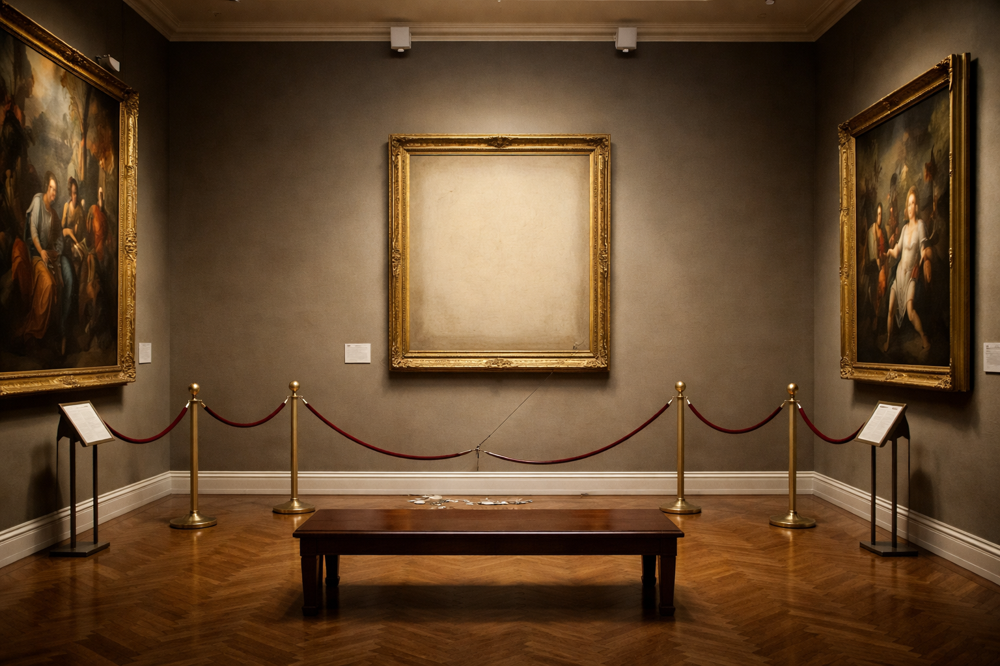
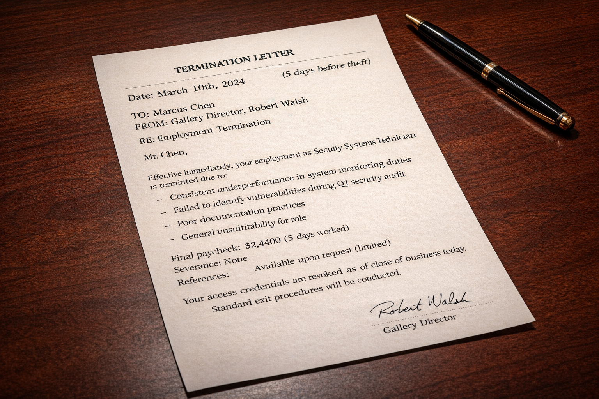

# Understanding the Use Case

"Welcome, everyone. In the dead of night, a masterpiece worth millions vanished from the city's most secure art gallery. There was no forced entry, no smashed glass.. Just an empty space on the wall and a set of digital breadcrumbs.

The investigation has zeroed in on three individuals, each with a different connection to the gallery:

- Sophie Dubois, the night manager who was on duty.
- Marcus Chen, the security technician who was recently fired.
- Viktor Petrov, a shadowy figure whose name has surfaced in connection with the crime.

The truth is buried in a mountain of security logs, financial records, and phone calls. Today, your mission is not just to solve the crime, but to build the detectives that will. You will create a team of specialized AI agents designed to analyze the evidence, connect the dots, and expose the culprit."
